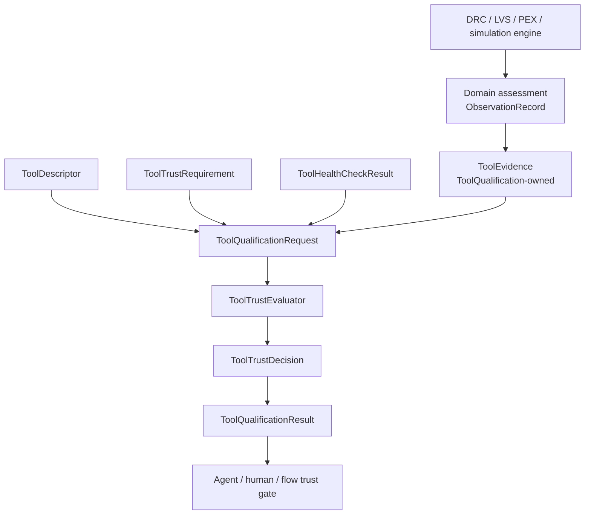

# ToolQualification Design Contract

## Responsibility

`ToolQualification` evaluates whether a tool is eligible for a requested flow
operation. It owns tool descriptors, capabilities, qualification levels,
evidence requirements, health-check interpretation, deterministic registry
selection, trust decisions, process-qualification evidence records, and the
headless CLI.

It never launches a tool. Domain engines produce domain assessments,
observations, artifacts, and provenance. This package validates those inputs,
builds qualification evidence, issues qualification records, and applies
fail-closed trust gates.

## CircuiteFoundation integration

The package depends on `CircuiteFoundation` for the shared artifact,
provenance, evidence, and diagnostic boundary. Clients import
`CircuiteFoundation` explicitly when they use those shared types:

- `ToolQualificationRequest` captures descriptor, requirement, health, input
  artifact references, and evaluation time.
- `ToolQualificationResult` carries the existing `ToolTrustDecision` together
  with Foundation artifact, diagnostic, and evidence surfaces.
- `ToolQualificationEngine` refines `CircuiteFoundation.Engine` for an
  asynchronous flow integration while the existing `ToolTrustEvaluator`
  remains independently usable and synchronous.

Project and run persistence is outside this package. Engine-facing evidence
uses Foundation types directly; Xcircuite supplies concrete persistence when a
flow needs `.xcircuite` storage.

## Trust boundary and ownership

| Concern | Owner |
|---|---|
| Shared artifact, provenance, evidence, and diagnostic types | CircuiteFoundation |
| Tool descriptors, capabilities, evidence freshness, trust decisions | ToolQualification |
| Native corpus/oracle and health execution | Domain engines / SignoffToolSupport |
| Tool process launching | SignoffToolSupport or domain adapter |
| Flow-stage ordering and approval gates | DesignFlowKernel |
| Project/run ledger and artifact persistence | Xcircuite / DesignFlowKernel |

## Deliberate non-goals

- No tool execution, parser, DRC/LVS/PEX algorithm, or foundry-rule database.
- No self-certification: a declared qualification level requires supporting
  evidence and freshness checks.
- No conversion of a process exit code into a passing trust decision.
- No project/run migration, filesystem persistence, or flow lifecycle.

## Concrete engine boundary

`DefaultToolQualificationEngine` is the concrete Foundation-facing engine. It
invokes the existing synchronous `ToolTrustEvaluator`, maps both evaluator and
health diagnostics to Foundation diagnostics without losing their original
codes, records request inputs and evaluation timestamps in
`ExecutionProvenance`, and returns a Foundation-backed result.

It preserves deterministic registry ordering, health and freshness gates, and
independence requirements. It does not launch tools or create qualification
evidence that was not supplied by the caller. CLI commands expose
domain-specific, typed records and diagnostics; they are not a persistence
contract for another package.

## Production evidence invariant

`productionEligible` is derived from a complete process record, never from the
descriptor level. The record retains the exact tool and oracle binaries, PDK and
deck scope, corpus/oracle/health artifacts, and qualified input and output
artifacts. Primary and oracle executables and output artifacts must be distinct,
oracle metric comparisons are bound to both case outcomes, and operating-corner
coverage is promoted only from the intersection required of both corpus and
independent-oracle results. Every reference
carries SHA-256 and byte count. ToolQualification, domain packages, and
Xcircuite re-verify the referenced bytes before accepting it. Human approval is
owned by DesignFlowKernel and ReleaseEngine.
