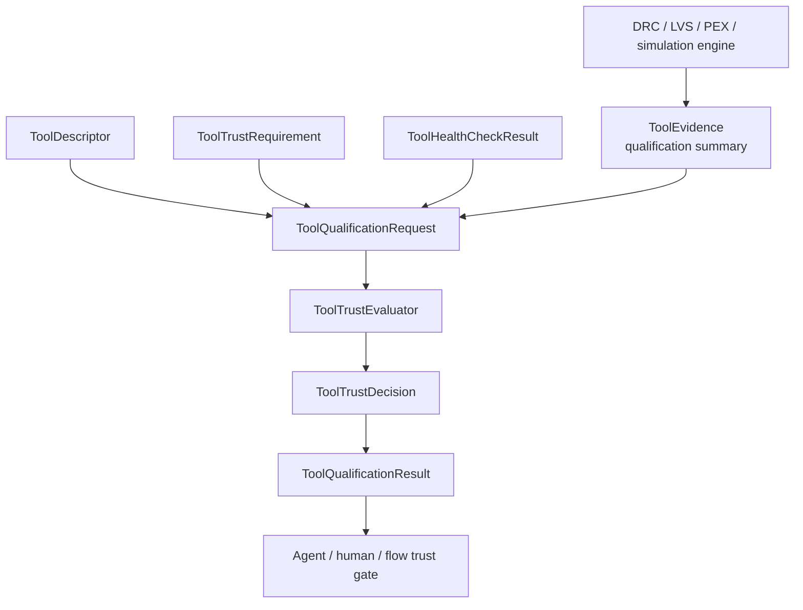

# ToolQualification Design Contract

## Responsibility

`ToolQualification` evaluates whether a tool is eligible for a requested flow
operation. It owns tool descriptors, capabilities, qualification levels,
evidence requirements, health-check interpretation, deterministic registry
selection, trust decisions, process-qualification evidence records, and the
headless CLI.

It never launches a tool. Domain engines produce native qualification reports;
this package evaluates the declared evidence and applies fail-closed trust
gates.

## CircuiteFoundation integration

The package depends on and re-exports `CircuiteFoundation` for the shared
artifact, provenance, evidence, and diagnostic boundary:

- `ToolQualificationRequest` captures descriptor, requirement, health, input
  artifact references, and evaluation time.
- `ToolQualificationResult` carries the existing `ToolTrustDecision` together
  with Foundation artifact, diagnostic, and evidence surfaces.
- `ToolQualificationEngine` refines `CircuiteFoundation.Engine` for an
  asynchronous flow integration while the existing `ToolTrustEvaluator`
  remains independently usable and synchronous.

`XcircuitePackage` models remain compatibility input models for existing
project/run JSON and file formats. They are not the new cross-package contract;
new engine-facing evidence uses Foundation types.

## Trust boundary and ownership

| Concern | Owner |
|---|---|
| Shared artifact, provenance, evidence, and diagnostic types | CircuiteFoundation |
| Tool descriptors, capabilities, evidence freshness, trust decisions | ToolQualification |
| Native corpus/oracle and health execution | Domain engines / SignoffToolSupport |
| Tool process launching | SignoffToolSupport or domain adapter |
| Flow-stage ordering and approval gates | DesignFlowKernel |
| Project/run ledger and artifact persistence | Xcircuite / DesignFlowKernel |

## Deliberate non-goals

- No tool execution, parser, DRC/LVS/PEX algorithm, or foundry-rule database.
- No self-certification: a declared qualification level requires supporting
  evidence and freshness checks.
- No conversion of a process exit code into a passing trust decision.
- No removal of existing Xcircuite compatibility models without a migration
  decision record.

## Concrete engine boundary

`ToolQualificationEngineAdapter` is the concrete Foundation-facing engine. It
invokes the existing synchronous `ToolTrustEvaluator`, maps both evaluator and
health diagnostics to Foundation diagnostics without losing their original
codes, records request inputs and evaluation timestamps in
`ExecutionProvenance`, and returns a Foundation-backed result.

It preserves deterministic registry ordering, health and freshness gates,
independence requirements, and the existing CLI envelopes. It does not launch
tools or create qualification evidence that was not supplied by the caller.
