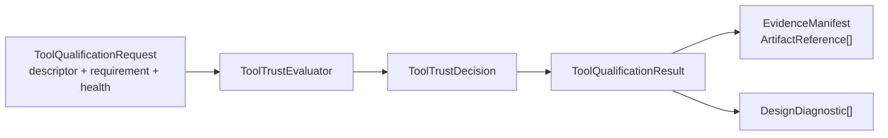
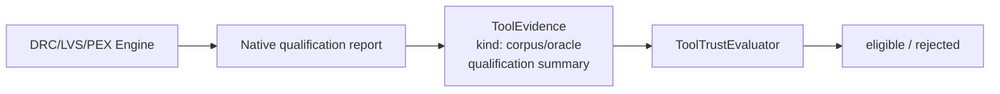

# ToolQualification

Tool trust contract for the design platform. A flow's reliability depends on the
tools that process the design, so tools are not just invoked — their capabilities,
versions, verified scope, and failure conditions are captured and gated before a
flow may use them. This package holds the contract only; it never launches a tool
(execution, parsers, and domain validation stay in the engine packages).

## Xcircuite integration

[`Xcircuite`](https://github.com/1amageek/Xcircuite) is the umbrella runtime
that consumes tool descriptors, health results, qualification evidence, and
trust decisions when constructing flow stages. `ToolQualification` remains an
independent trust contract and does not own project orchestration or engine
execution.

## CircuiteFoundation boundary

Trust evaluation remains the responsibility of this package, while
`CircuiteFoundation` supplies the shared artifact, provenance, and diagnostic
boundary used by flow engines. `ToolQualificationRequest` captures the exact
inputs to an evaluation; `ToolQualificationResult` carries the decision and the
evidence manifest that can be persisted or reviewed by an Agent or a human.



`DefaultToolQualificationEngine` is the concrete asynchronous
`ToolQualificationEngine` implementation for flow integration. It delegates to
the synchronous evaluator and preserves both evaluator and health diagnostics
in Foundation form. The CLI remains usable independently and this package has
no dependency on project, run, or workspace storage.

## Types

| Type | Responsibility |
|---|---|
| `ToolDescriptor` | Stable tool ID, kind, version, capabilities, trust profile, environment |
| `ToolKind` / `ToolCapability` | Operation IDs and input/output format compatibility |
| `ToolTrustProfile` / `ToolQualificationLevel` | Qualification level (`unknown` → `smokeChecked` → `corpusChecked` → `oracleChecked` → `productionEligible`) plus evidence and known limitations |
| `ToolEvidence` / `ToolEvidenceKind` | Evidence backing a qualification level |
| `ToolEvidenceQualificationSummary` | Generic pass/fail summary for evidence produced by engine-owned corpus/oracle qualification |
| `ToolHealthCheckResult` / `ToolHealthStatus` | Pass/fail/blocked/notChecked with diagnostics |
| `ToolTrustRequirement` | What a flow stage demands: operation, minimum qualification, formats, required evidence, qualified evidence, freshness, health gate |
| `ToolTrustEvaluator` / `ToolTrustDecision` | Eligible/rejected verdict from descriptor + requirement + health |
| `ToolRegistry` | Registers descriptors, selects eligible candidates deterministically |
| `ToolEnvironment` / `ToolAsset` | Executable paths, platform, required assets (PDK, rule decks) |
| `ToolQualificationScope` / `ToolOracleQualificationScope` | Exact tool version/binary, algorithm, process, deck, PDK and independent oracle binary scope |
| `ToolProcessQualificationEvidence` | Complete retained corpus/oracle/health/approval evidence graph plus qualified input/output artifacts and validity window |
| `ToolProcessQualificationEvidenceBuilder` | Promotes artifact-backed independent corpus, oracle, health and production-approval evidence into a qualified process record |
| `ToolQualificationCLICore` / `toolqualification` | Testable CLI core + headless executable |

## Rules

- `unknown` tools are never used for production gates by default.
- A skipped health check is not a pass; flows that require a health gate block
  instead of silently proceeding.
- `requiredEvidenceKinds` checks that the requested evidence exists on either
  the descriptor trust profile or the latest health result.
- `requiredQualifiedEvidenceKinds` is stronger: evidence of that kind must exist
  and at least one matching `ToolEvidence` must carry a
  `ToolEvidenceQualificationSummary` with `qualified == true` and a non-empty,
  SHA-256-bound immutable artifact. Metrics or policy identifiers alone are not evidence.
- `minimumLevel` and the descriptor's declared `trustProfile.level` both imply
  minimum qualified evidence. A tool cannot self-declare a higher level without
  evidence that supports that level.
- `maximumEvidenceAgeSeconds` is stronger again: every required evidence kind
  must have at least one matching `ToolEvidence.checkedAt` timestamp that is not
  older than the declared age at evaluation time. Missing timestamps are not
  treated as fresh evidence.
- Engine packages own domain-specific qualification reports. For example, DRC/LVS
  corpus runners persist their native summary and policy result, then callers map
  the relevant aggregate metrics and failure codes into
  `ToolEvidenceQualificationSummary`. `ToolQualification` does not import DRC/LVS
  engine types.
- `productionEligible` additionally requires a retained
  `ToolProcessQualificationEvidence` whose tool ID/version/binary, process, PDK,
  deck and independent oracle scope match exactly. Its corpus, oracle, health,
  human approval, qualified input and qualified output artifact groups must all
  be complete and fresh.

| Level | Implied qualified evidence |
|---|---|
| `unknown` | none |
| `smokeChecked` | `smoke` |
| `corpusChecked` | `corpus` |
| `oracleChecked` | `corpus`, `oracle` |
| `productionEligible` | `corpus`, `oracle`, `healthCheck` |



## Headless CLI

`toolqualification` exposes the exact evaluation semantics DesignFlowKernel
applies per flow stage — `ToolTrustEvaluator().evaluate(descriptor:requirement:health:)` —
so an agent can preflight trust decisions from a shell before wiring a flow.
The command logic lives in the testable `ToolQualificationCLICore` library;
the executable target is a thin entry point.

### evaluate

Evaluate one `ToolDescriptor` against a `ToolTrustRequirement`, with an
optional `ToolHealthCheckResult`:

```bash
toolqualification evaluate \
  --descriptor descriptor.json \
  --requirement requirement.json \
  --health health.json \
  --pretty
```

All input files are this package's own Codable models serialized as JSON
(`ToolDescriptor`, `ToolTrustRequirement`, `ToolHealthCheckResult`). stdout is
a single command-specific JSON result:

```json
{
  "command": "evaluate",
  "toolID": "sim.corespice",
  "eligible": true,
  "decision": { "toolID": "sim.corespice", "status": "eligible", "diagnostics": [] },
  "inputs": {
    "descriptorPath": "…", "descriptorToolID": "…", "descriptorVersion": "…",
    "descriptorKind": "…", "descriptorTrustLevel": "…",
    "requirementPath": "…", "requirementKind": "…",
    "requirementOperationID": "…", "requirementMinimumLevel": "…",
    "healthPath": "…", "healthToolID": "…", "healthStatus": "…"
  }
}
```

`decision` is the full `ToolTrustDecision`, including every rejection
diagnostic (`TOOL_KIND_MISMATCH`, `INSUFFICIENT_TRUST_LEVEL`,
`MISSING_REQUIRED_EVIDENCE`, …) and `KNOWN_LIMITATION` warnings.

### evaluate-registry

Evaluate every descriptor in a JSON array against one requirement, with an
optional `toolID -> ToolHealthCheckResult` dictionary:

```bash
toolqualification evaluate-registry \
  --descriptors descriptors.json \
  --requirement requirement.json \
  --health-results health-results.json
```

Decisions are ranked exactly the way `DesignFlowKernel` orders stage tools:
eligible first, then trust level descending, then toolID ascending.
`selectedToolID` is the first eligible tool, if any:

```json
{
  "command": "evaluate-registry",
  "requirement": { "kind": "…", "operationID": "…", "minimumLevel": "…" },
  "evaluatedCount": 2,
  "eligibleCount": 2,
  "selectedToolID": "sim.ngspice",
  "decisions": [
    { "toolID": "…", "toolVersion": "…", "trustLevel": "…", "eligible": true, "decision": { } }
  ]
}
```

### validate-process-evidence

Validate a persisted process qualification record independently of a flow run.
The command separates structural validity, PDK scope completeness, freshness,
independence and approval blockers. It exits 2 for a readable but unqualified
record, so a missing human or foundry approval cannot be interpreted as a pass:

```bash
toolqualification validate-process-evidence \
  --evidence process-qualification-evidence.json \
  --require-pdk \
  --at 1782940000 \
  --pretty
```

The JSON result includes the exact qualification scope, retained artifact graph,
and qualification window. Schema version 2 is intentionally breaking and does
not decode ID-only qualification records.

### build-process-evidence

Build a process qualification record only from a JSON
`ToolProcessQualificationEvidenceBuildRequest` containing complete PDK scope,
artifact-backed independent corpus/oracle/health/production-approval evidence,
and a valid qualification window:

```bash
toolqualification build-process-evidence \
  --input process-qualification-build-request.json \
  --output process-qualification-evidence.json \
  --pretty
```

The builder verifies evidence kinds, independent passing qualification summaries,
artifact IDs, project-relative paths, SHA-256 digests, byte counts, scope and
validity. It exits 2 without writing an output record when any promotion
condition is missing. This command creates a reproducible local record from
already-produced evidence; it does not claim foundry qualification by itself.

### Exit codes and diagnostics

| Exit | Meaning |
|---|---|
| 0 | Eligible (`evaluate`) / at least one eligible tool (`evaluate-registry`) |
| 2 | Evaluated but not eligible / no eligible tool |
| 1 | Invalid arguments, unreadable file, or invalid JSON |

Failures never print bare prose: stderr carries a single JSON diagnostic
record with a stable code —

```json
{"code": "toolqualification.cli.unreadable-file", "message": "Cannot read file at …"}
```

Codes: `toolqualification.cli.invalid-arguments`,
`toolqualification.cli.unreadable-file`, `toolqualification.cli.invalid-json`,
`toolqualification.cli.internal-error`. `toolqualification --help`,
`evaluate --help`, `evaluate-registry --help`, and
`validate-process-evidence --help` and `build-process-evidence --help` document
the full surface.

## Build & test

```bash
swift build
swift test
```
